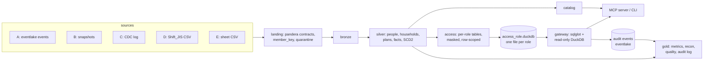

**All data in this repository is synthetic and unrelated to any real person or organization.**

# cross-product-dbt

[](https://github.com/dkurokawa/cross-product-dbt/actions)

A working template for putting one shared data platform on top of products that were built
independently. Python and dbt, run on DuckDB, with the models written so that they also compile
for BigQuery.

## The problem

Products that start separately grow their own IDs, their own schemas and their own idea of what
"an active member" is. Then a company is acquired and brings a third billing system. A price
revision splits a contract table into two generations with different plan codes. A sales team
keeps a spreadsheet whose column names change from month to month. Later someone asks for one
number, and there is no key that says two records are the same person, let alone the same
household.

This repository builds the layer that is added afterwards. It lands five differently shaped
sources with data contracts, matches people and households across them, defines shared metrics in
one file, checks that the products' own numbers stay within known distance of those definitions,
keeps personal data out of the places it should not be, and lets an analyst (or an LLM) query
the result through one audited entry point.

The business domain is a fictional fitness chain. Nothing here is modelled on a real company.

## The five sources

Each source is written the way its product would write it. The inconsistencies are deliberate.

| | Product (fictional) | Shape | Deliberate inconsistencies |
|---|---|---|---|
| A | consumer app | [eventlake](https://github.com/dkurokawa/eventlake) events | UTC, UUID ids, tax-inclusive purchases, family accounts (a guardian registers a child), re-delivered events |
| B | studio reservation SaaS | full-table snapshots (Parquet) | `tenant_id` plus a member number that is only unique inside the tenant, naive Tokyo time, tax-exclusive prices, logical delete |
| C | gym back office | change-data-capture log (`op` I/U/D) | two contract table generations (FY2025 and FY2026) with different plan codes and columns, the same row updated repeatedly, deletes |
| D | acquired billing software | Shift_JIS CSV, daily | Japanese headers, `YYYY/MM/DD`, its own plan codes, refunds in a separate file, customers known only by kana name and phone number |
| E | corporate-sales sheet | monthly CSV | header names drift between months, `—` and full-width digits in numeric cells |

The same people and the same households appear in several products (`--overlap`), each time
written the way that product writes them. Two columns hold sensitive free text: `health_notes`
(A) and `medical_conditions` (C).

## Architecture



* **landing** (Python): every file is checked against a pandera contract. A file that fails moves
  to `quarantine/<source>/<date>/` with a JSON reason (column names and counts, never values).
  Python also adds `member_key = HMAC-SHA256(salt, normalized e-mail)` (phone, then phone + kana
  as fallbacks), so the salt never appears in compiled SQL.
* **bronze**: shape only (types, UTC, encoding). No rows are dropped, except that re-delivered
  eventlake events collapse to one, by eventlake's own read rule.
* **silver**: `dim_member`, `dim_household`, `dim_account`, `dim_plan` (a seed that maps every
  source's plan codes to one plan system), `fct_session`, `fct_booking`, `fct_payment` (tax
  inclusive, with the original amount kept), `fct_activity`, and the C contract history as SCD2.
* **gold**: the metrics and their reconciliation, `ingest_quality_daily`, `identity_quality`,
  `audit_access_log`.
* **access**: one table per role and table, generated from `policies/access.yml`. Roles that see
  every product (`analyst`, `privacy_officer`) get the cross-product person and household
  tables. A product role gets, under the same names, tables built from its own product's records
  alone: no attribute is taken from another product, there are no cross-product flags or counts,
  and reference tables such as `dim_plan` hold only its own codes. The keys in those tables
  (`member_key`, `household_key`) are product-scoped pseudonyms, `sha256(product || ':' || key)`,
  computed in SQL: they join within the product but match no other product's key and no
  canonical key. They have to be, because a canonical key next to a product's own id, or shared
  between two product roles, would let them compare notes (for D, whose own id is a hash of
  phone and kana, the difference would show which customers were matched to another product).
  A derived-hash id like D's is dropped from that product's tables.
* **Deleted records.** A record deleted in its source (C `op = D`, B logical delete) contributes
  nothing downstream: no attributes, no product flag, no sensitive text. A person with no live
  record is not in `dim_member` or in any access table. The number of such records is reported
  in `identity_quality` (`deleted_in_source`).

## Decisions that shape the code

* **One file defines the metrics.** `metrics/metrics.yml` is the only place a metric is defined.
  `platform metrics generate` writes the gold models, their contracts and tests, the
  reconciliation models and `docs/metrics.md`; every generated file says "do not edit", and CI
  regenerates and fails on any difference.
* **Same name, different definition is caught in two stages.** Statically, a hand-written model
  may not create a column named like a metric or like a product's own KPI (checked against dbt's
  manifest and catalog). On the data, each product's self-reported KPI is compared with the
  canonical value, and a gap that is not inside its declared band fails a test. A KPI that is not
  a declared `known_variant` fails the check.
* **Personal data is declared and detected.** Every column carries `meta.pii`
  (`none`/`quasi`/`direct`/`sensitive`). `platform scan` reads the landed data with its own
  detectors (column names, value patterns, free-text shape) and fails when something detected is
  declared `none` or not declared.
* **Hide, then mask, then copy.** Sensitive columns are not in a restricted role's tables at all.
  Direct identifiers are masked (e-mail: domain; phone: last four digits; birth date: year; name:
  first character). The only copy of an identifier that leaves its table is the hashed join key.
* **Independent layers of protection.** DuckDB has no permissions, so the gateway stacks three
  layers that do not depend on one another: a sqlglot check of the statement; a database opened
  `read_only` with external access off and the configuration locked; and a database file that
  contains only the role's access tables.
* **Every gateway call is audited** with eventlake: `QueryExecuted` or `QueryDenied`, with the
  normalized SQL (literals removed), tables, columns and the reason. `gold.audit_access_log` makes
  "who read a sensitive column" a SQL query.
* **The MCP server's role is fixed at start-up** from `PLATFORM_ROLE` and `PLATFORM_PRINCIPAL`.
  No tool argument can change it; a missing or unknown role stops the server from starting.
* **Orchestration is a Makefile and a Python CLI.** No scheduler. **dbt_utils is the only dbt
  package**; the anomaly test and the contracts are written here.

## Quickstart

```bash
uv sync --all-groups
make demo
```

`make demo` needs no credentials and no network beyond `dbt deps`. It uses an obviously fake
demo salt; set `PLATFORM_HMAC_SALT` yourself for anything else, because `platform ingest` refuses
to run without one. It runs, in order: ingest, `dbt deps`, `dbt build` (models, tests, unit
tests), one database file per role, sample gateway calls and the audit models, source freshness,
`dbt docs generate`, the guards, the catalog, and an MCP smoke test. Selected lines of a run:

```text
ingest: 3585 files landed, 5 quarantined -> build/lake
Done. PASS=311 WARN=0 ERROR=0 SKIP=0 NO-OP=0 REUSED=0 TOTAL=311
build-roles: analyst: 19 tables
audit log ok: the privacy officer's read and the analyst's attempt are both recorded
metrics check: 0 problem(s)
access check: 0 problem(s)
scan: 0 problem(s), 0 warning(s)
catalog build: 168 tables, 9 files -> build/catalog
mcp smoke ok: 4 tools, latest metric returned, analyst asking for health_notes refused
```

Other targets: `make test` (pytest with coverage), `make lint` (ruff, mypy `--strict`, sqlfluff,
dialect denylist), `make bq-compile`, `make anomaly-check`, `make unmapped-check`, `make generate`
(regenerate the metric and access files). A plain `dbt build` also works after `platform ingest`,
before any gateway call: with no gateway events yet, the audit models read an empty relation with
the right column types. `make audit` rebuilds them after the gateway has produced events, and the
per-role database files are built again afterwards so that the privacy officer's file contains
`audit_access_log`.

### Querying through the gateway

```bash
$ platform query --role analyst --principal ada "select count(*) as members from dim_member"
{"members": 4525}
query: 1 row(s)

$ platform query --role analyst --principal ada \
    "select name_initial, email_domain, phone_last4, birth_date_year from dim_member limit 2"
{"name_initial": "鈴***", "email_domain": "example.jp", "phone_last4": "4651", "birth_date_year": 1987}
{"name_initial": "加***", "email_domain": "example.jp", "phone_last4": "6911", "birth_date_year": 1966}
query: 2 row(s)

$ platform query --role analyst --principal ada "select health_notes from dim_member"
query denied: column check failed: Column 'health_notes' could not be resolved. Line: 1, Col: 19

$ platform query --role analyst --principal ada "select * from read_parquet('/etc/passwd')"
query denied: table functions are not allowed

$ platform query --role analyst --principal ada "select columns('health.*') from dim_member"
query denied: dynamic column selection (COLUMNS, #n) is not allowed

$ platform query --role product_b --principal bea \
    "select count(*) as members, count(birth_date_year) as with_birth_year from dim_member"
{"members": 1092, "with_birth_year": 0}
query: 1 row(s)
```

The last query shows the product scoping: product B's `dim_member` has exactly B's live
members and no birth date, because B does not collect one (an earlier version filled it in from
other products). The principal is whatever the caller declares. It is recorded, not verified.

### MCP server

```bash
claude mcp add cross-product-analyst \
  -e PLATFORM_ROLE=analyst -e PLATFORM_PRINCIPAL=claude-code \
  -- uv run --directory /path/to/cross-product-dbt platform serve-mcp
```

Four read-only tools: `search_tables`, `describe_table`, `get_metric` (definition, known
variants, latest value) and `run_query`. When the analyst role asks for `health_notes` the tool
returns an error, and the audit log records the attempt:

```text
is_error: True | Error executing tool run_query: query denied: column check failed: Column 'health_notes' could not be resolved. Line: 1, Col: 19
```

```text
outcome  principal    role             touched_sensitive  sensitive_columns  deny_reason
denied   nosy         analyst          true               health_notes       column check failed: Column 'health_notes' could not be resolved. Line: 1, Col: 19
executed audrey       privacy_officer  true               health_notes
executed audrey       privacy_officer  false
denied   claude-code  analyst          true               health_notes       column check failed: Column 'health_notes' could not be resolved. Line: 1, Col: 19
```

(`audrey` is the privacy officer's sample query in `scripts/audit_demo.py`, and the query that
reads the log itself, which is audited too; `claude-code` is the MCP call above.
`gold.audit_access_log`, selected columns. Only the privacy officer can read this table
through the gateway: `platform query --role privacy_officer --principal audrey "select ... from
audit_access_log where touched_sensitive"`.)

## Results

Produced from a fresh clone at commit `2e6093b` on 2026-09-30, on a Mac mini M4, with the seed and
sizes of the default run (5,000 people, 12 months from 2025-10-01). Only documentation changed
after that commit.

**Run times.** `make demo` 75 s (including `dbt deps`); `dbt build` alone 8.6 s for 311 nodes
(1 seed, 167 models, 128 data tests, 15 unit tests); `make test` 45 s wall time (203 tests,
coverage 98.71%).

**Landing.** 3,585 files landed (A 1,874 files / 111,831 rows; B 106 / 1,007,313; C 1,131 /
47,289; D 457 / 3,618; E 12 / 1,093; KPI files 5 / 192). 5 files were quarantined, one per source,
each an injected malformed re-delivery: A a null `member_id`; B a snapshot missing three columns;
C an unknown `op`; D a header renamed by the vendor; E an unknown column name.

**Silver and access.** `dim_member` 4,525 (856 appear in more than one product; 327 of the 528
people in D were matched to another product), `dim_household` 4,145 (340 with more than one
member), `dim_member_by_product` 5,381 rows (what product roles are built from), `fct_payment`
11,880, `fct_session` 76,588, `fct_booking` 29,456, `fct_activity` 100,978, `scd_contract` 4,872
versions across 2,834 contracts, 117 access tables in 7 roles.

**Identity.** Members identified by e-mail: A 2,012, B 1,092, C 1,550; by phone: C 10; by phone
and kana: D 528. 189 members could not be matched (`source_local`: A 109, C 80). 400 records
were deleted in their source and contribute nothing downstream (B 374 logical deletes, C 26
`op = D`). 0 ambiguous phone+kana links.

**Reconciliation.** What each product reports for itself against the canonical metric for the
same product scope, September 2026, and the range of the gap over the 12 months. "Explained" is
the recon test result over all 12 months.

| metric | product | reported as | reported | canonical | gap % (Sep) | gap % range | explained |
|---|---|---|---|---|---|---|---|
| active_members | A | active_users | 1,464 | 1,219 | 20.1 | 17.2 .. 22.4 | yes |
| active_members | B | active_customers | 836 | 849 | -1.5 | -1.5 .. 42.2 | yes |
| active_members | C | active_members | 1,245 | 1,014 | 22.8 | 22.8 .. 31.0 | yes |
| active_members | D | billed_customers | 304 | 199 | 52.8 | 44.2 .. 111.0 | yes |
| active_members | E | seats_under_contract | 12,626 | n/a | n/a | n/a | not comparable |
| net_revenue | A | iap_revenue | 3,256,920 | 3,266,180 | -0.3 | -0.8 .. 0.4 | yes |
| net_revenue | B | booking_revenue | 8,341,000 | n/a | n/a | n/a | not comparable |
| net_revenue | C | monthly_revenue | 8,952,900 | n/a | n/a | n/a | not comparable |
| net_revenue | D | net_sales | 1,970,000 | 2,167,000 | -9.1 | -9.1 .. -9.1 | yes (tax-exclusive) |
| net_revenue | E | mrr | 37,386,000 | n/a | n/a | n/a | not comparable |
| churned_members | B | lost_customers | 364 | 120 | 203.3 | -76.5 .. 203.3 | not comparable |
| churned_members | C | churned_members | 75 | 195 | -61.5 | -86.9 .. 755.9 | not comparable |
| churned_members | D | cancelled_customers | 206 | 44 | 368.2 | -78.6 .. 368.2 | not comparable |
| sessions_per_active_member | A | workouts_per_user | 2.4 | 2.9 | -15.9 | -19.6 .. -10.0 | yes |
| sessions_per_active_member | B | bookings_per_customer | 2.9 | 3.0 | -3.4 | -3.4 .. 48.4 | yes |
| sessions_per_active_member | C | avg_visits_per_member | 2.8 | 3.3 | -17.3 | -26.0 .. -16.2 | yes |

Why the seven "not comparable" rows are not tested:

* E `seats_under_contract`: corporate accounts have no member-level activity, so there is no
  canonical counterpart.
* B `booking_revenue`, C `monthly_revenue`, E `mrr`: `fct_payment` holds only A purchases and D
  invoices and refunds, so booking prices and contract fees have no canonical counterpart.
* B/C/D churn: each product counts something else (booking inactivity, contract end events,
  invoice cadence), and canonical churn is activity-based; the relationship is not stable. The
  C row shows it: the April price-list migration closes and re-opens every contract, and the
  gap in that month is +756%.

## Design notes and known limitations

* **The recon thresholds and directions were set after the first run.** They were chosen after
  looking at the first reconciliation on this seed (see the header of `metrics/metrics.yml`). The
  recon test therefore does not prove that today's gaps are right. Its job is to catch new drift:
  a variant whose gap moves outside its known band. It is silent about the seven variants that
  are not comparable. The bands were set once more when records deleted in their source stopped
  reaching silver: B still counts customers it has marked deleted and the canonical metric no
  longer does, so B's `active_customers` band was widened from 15 to 50 percent. That change is
  recorded in `metrics/metrics.yml`.
* **Canonical scope per product.** A product's canonical value is scoped to that product's own
  activity (A, B, C) or, for D which has no activity of its own, to D's customers. This is an
  interpretation; the alternative (all activity of the product's members) gave unstable
  directions.
* **Identity.** Products that know a person by e-mail share a `member_key`. D knows only phone
  and kana, so every record where both exist also carries a `link_key` (a hash of `phone|kana`),
  and D is attached to the e-mail identity that shares it. The rule "same phone and kana name is
  the same person" is deliberate; when one link resolves more than one e-mail identity they are
  merged by the smallest key and counted (`identity_quality`, `ambiguous_link`, 0 in this data,
  covered by a unit test). Records with no e-mail, phone or kana (some children) are counted as
  unmatched.
* **Deleted records.** C `op = D` and B logical deletes are dropped before identity matching, so
  they add no attribute, product flag or sensitive text, and their facts (sessions, bookings,
  contract versions) are dropped with them. This removes a quarter of B's customers from the
  shared model, which is why the B recon band above is wide.
* **Generated metrics cover the whole period.** Every metric has a row for each month of the
  period (from a month spine built from the landed period) and each product scope, with 0 where
  nothing happened; a generated test checks it. The first month of `churned_members` is 0
  because there is no earlier window to compare with, not because nobody left.
* **Landing history.** Each `platform ingest` run writes its own metadata files
  (`_meta/*/run-<id>.parquet`), so a later `--no-generate` run adds to the history instead of
  replacing it.
* **D is decoded in Python.** DuckDB reads Shift_JIS only through its `encodings` extension,
  which it downloads on first use; landing must work offline, so the file is decoded (as
  Windows-31J) at landing and stored as UTF-8 with the original Japanese headers.
* **Freshness uses ingest time.** The generated period is fixed for reproducibility, so a
  comparison with the data's last date would go stale. Every landed file carries `ingested_at`;
  `dbt source freshness` warns after 24 hours and fails after 72.
* **`row_count_anomaly(window=28, z=3)`** compares a day's row count with the previous 28 rows
  that have data (days with data, not calendar days), reports a missing day as `missing_day`, and
  only warns. `make anomaly-check` shows it is quiet on the clean data and flags exactly the
  injected gap day.
* **B snapshots** are delivered every 7 days by default, not daily (`b_snapshot_every_days`),
  to keep the demo small.
* **The principal is self-declared.** There is no authentication in this template. The audit log
  records what the caller said. On BigQuery the IAM principal in `INFORMATION_SCHEMA.JOBS` is the
  trustworthy counterpart.
* **`platform scan` reads the first 100 rows of every landed file.** It catches an undeclared
  personal-data column and a mis-declared one (declared weaker than detected), wherever it
  appears in the data. It does not catch values deliberately placed further down a file.
* **Product roles see pseudonymous keys.** See the access layer above: canonical keys would let
  two product roles, or a product and the cross-product view, be linked. The analyst and the
  privacy officer keep canonical keys.
* **The sqlglot check is heuristic.** It stops the obvious things and produces useful audit
  records, but a parser can have gaps. The guarantees are the other two layers: the read-only
  database with external access off and its configuration locked, and the per-role file that
  does not contain what the role may not see. Tests call the execution layer directly to show
  those two hold without the SQL check.
* **BigQuery is compile-only.** CI runs `dbt compile --target bigquery --no-introspect
  --no-populate-cache` with a throwaway fake service-account key generated at run time; nothing
  connects. The models have not been run against a real BigQuery project. Athena and Snowflake
  have not been attempted. The gateway and the per-role files are DuckDB-specific by design.
* **Synthetic data only.** The generators are seeded and deterministic. Names, e-mail addresses
  and phone numbers are fabricated.

## Threat model

What is protected: the query path that a CLI user, an LLM through the MCP server, or any other
client goes through. The gateway checks the statement, opens only a per-role database file
read-only with external access off and its configuration locked, and audits every call; the MCP
server's role is fixed when it starts, so a model cannot change it through a tool argument.

What is not: there is no authentication. Anyone with a shell or file access can pass any
`--role` to `platform query`, start the MCP server with any `PLATFORM_ROLE`, or open
`build/warehouse/*.duckdb` (including the main warehouse with the raw silver tables) directly,
and the principal in the audit log is whatever the caller wrote. In a real deployment the role
would come from an authenticated identity, and the warehouse and the per-role files would be
permissioned so that only the gateway's service account can read them. On BigQuery the
equivalent is IAM, with authorized views over the access layer, and the query log in
`INFORMATION_SCHEMA.JOBS`.

## Layout

```text
src/cross_product_platform/   generators/, contracts/, landing, identity, household,
                              metrics/, access, scan, gateway, roles, audit, catalog, mcp_server
dbt/                          models/{bronze,silver,gold,access}, macros/, seeds/, tests/
metrics/metrics.yml           the metric definitions
policies/access.yml           roles and row scopes; policies/gateway_allowlist.json is generated
scripts/                      negative-path checks, audit demo, MCP smoke test
```

## License

MIT. See `LICENSE`.

---

# 日本語での概要

このリポジトリのデータはすべて合成で、実在の個人・組織とは無関係です。

**何を作っているか。** 別々に作られた複数のプロダクトの上に、あとから共通のデータ基盤を敷く雛形です
（Python + dbt、DuckDB で動作。モデルは BigQuery 向けにもコンパイルできる書き方）。題材は架空の
フィットネスチェーンです。

**なぜ必要か（一般論）。** 別々に立ち上がったプロダクトは、それぞれ ID もスキーマも「アクティブ会員」の
定義も違います。買収で別の請求システムが加わり、料金改定で契約テーブルが 2 世代に分かれ、営業のスプレッド
シートは月ごとに列名が変わります。あとから「1 つの数字」を求めても、同一人物・同一世帯を示すキーがありません。

**5 つのデータ源。** A: 会員アプリ（eventlake のイベント）／B: 予約 SaaS（全件スナップショット）／
C: 基幹 DB（CDC ログ、契約テーブルが 2 世代）／D: 買収した請求ソフト（Shift_JIS の CSV、氏名カナ + 電話で識別）／
E: 法人営業の表（列名がゆれる CSV）。ゆれはすべてわざと入れています。

**構成。** landing（pandera の契約検査、不合格は quarantine、`member_key` は Python で HMAC）→ bronze
（形だけ揃える）→ silver（同一人物・世帯・プラン・ファクト・契約履歴）→ gold（指標、突き合わせ、品質、
監査ログ）→ access（ロール別の公開テーブル）。

**主な判断。**

* 指標の定義は `metrics/metrics.yml` の 1 か所。dbt モデルはそこからコード生成し、CI で「生成物が最新か」を
  検査します。
* 「同名で別定義」の検出は 2 段です。手書きモデルが指標名と同じ列を作れば静的に落とし、各プロダクトの自己
  申告 KPI は正の定義で計算し直した値と突き合わせて、既知の差の範囲を外れたら落とします。
* 個人情報は列ごとに `meta.pii` で宣言し、`platform scan` が取り込んだデータから独立に検出して、宣言漏れを
  落とします。
* 見せ方は「隠す → 伏せて見せる → コピー」の順です。要配慮の列は制限ロールのテーブルに存在せず、直接識別子
  はメールのドメイン・電話の末尾 4 桁・生年・氏名の先頭 1 文字に伏せます。プロダクトごとのロールは、そのプロ
  ダクト自身の記録だけから作った表を受け取り（他プロダクトの値や横断のフラグは入らず、キーも製品ごとの
  仮名になります）、元のシステムで
  削除された記録（C の `op = D`、B の論理削除）は下流に一切出ません。
* 防御は独立した 3 層です: sqlglot による SQL の検査／`read_only` + 外部アクセス無効 + 設定ロックの
  DuckDB／ロールごとに分けたデータベースファイル（見せない表がファイルに存在しない）。
* ゲートウェイの全呼び出しを eventlake の監査イベントに残し、`gold.audit_access_log` で「誰が要配慮列を
  読んだか」を SQL で引けます。
* MCP サーバのロールは起動時の環境変数で固定され、ツール引数では変えられません。
* オーケストレーションは Makefile と Python の CLI のみ。dbt のパッケージは dbt_utils だけです。

**使い方。** `uv sync --all-groups` のあと `make demo`（取り込み → dbt build → ロール別 DB → 監査 → ガード
→ カタログ → MCP スモークテスト。手元の Mac mini M4 で約 75 秒）。上の「Results」節に、コミット
`2e6093b` で実行した結果（突き合わせ表、件数、実行時間）を載せています。

**正直な限界。**

* 突き合わせの閾値と向きは、最初の実行結果を見てから決めました（削除記録を下流から外した際に B の帯を
  15% から 50% に広げ直しています）。テストの役目は「今の差が正しいと証明する」ことではなく、「既知の範囲
  から新たにずれた変種を見つける」ことです。比較できない 7 つの変種（収益と解約の
  一部、法人の座席数など）は、理由を上に書いたうえでテスト対象から外しています。
* 電話 + カナで同一人物とみなす規則は意図した割り切りで、同じ電話 + カナに複数のメール ID が結びつく場合は
  件数を数えて公開します（このデータでは 0 件）。
* D の Shift_JIS は、DuckDB の拡張（初回にダウンロード）に頼らないよう Python で取り込み時に復号します。
* 鮮度は、生成期間を固定しているため、取り込み時刻で判定します。
* 監査の主体（principal）は自己申告で、認証はありません。シェルやファイルにアクセスできる人は任意の
  `--role` を渡せ、`build/warehouse/*.duckdb` を直接開けます。本番ではロールを認証済みの ID から決め、ファイ
  ルとウェアハウスに権限を設定する前提です（BigQuery なら IAM と authorized view）。sqlglot の検査は
  ヒューリスティックで、保証はデータベース層とロール別ファイルの層が担います。
* `platform scan` は各ファイルの先頭 100 行を読みます。宣言漏れの列や弱く宣言された列は見つけますが、
  ファイルの奥に意図的に置かれた値は見つけられません。
* 指標は期間中のすべての月・すべてのプロダクトスコープについて行を出します（活動がなければ 0）。
  `churned_members` の最初の月は、比較する前の期間がないため 0 です。
* BigQuery は CI ではコンパイルのみ（偽のサービスアカウント鍵、接続なし）で、実プロジェクトでは未実行です。
  Athena と Snowflake は試していません。

ライセンスは MIT です。
